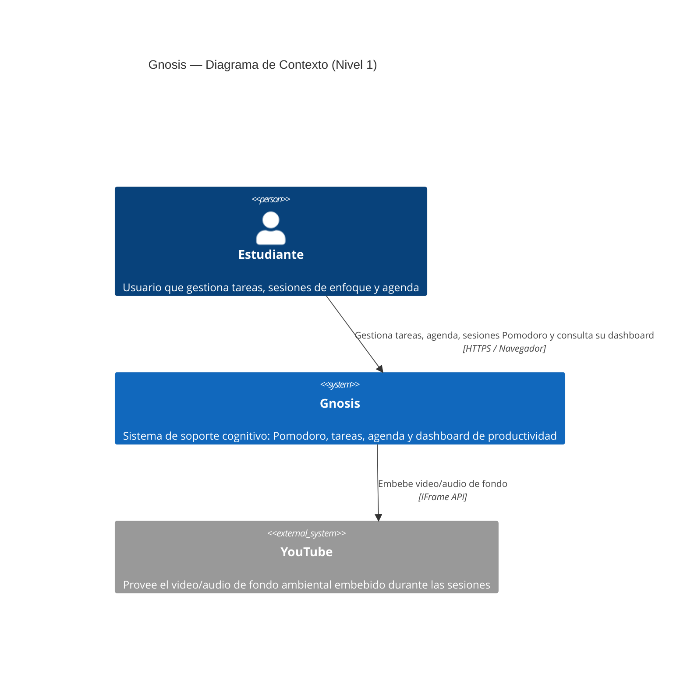
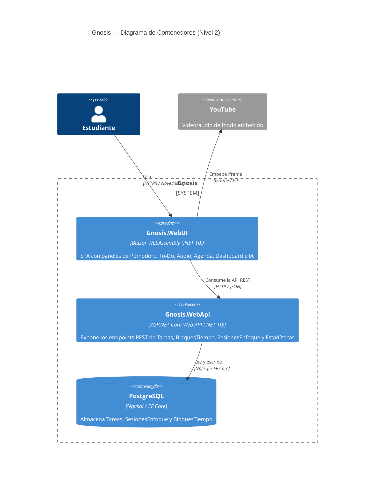
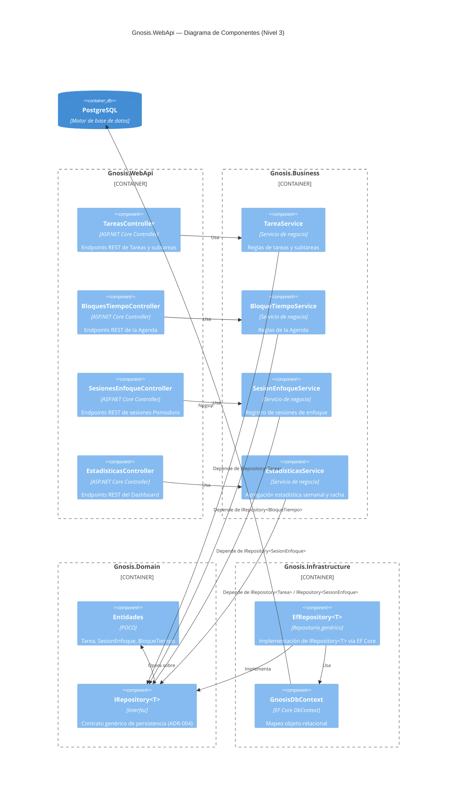

# Gnosis

Gnosis es una aplicación de productividad y soporte cognitivo construida con **Blazor WebAssembly (.NET 10)**. Combina un temporizador Pomodoro, una lista de tareas con desglose en subtareas (manual o asistido por IA), una agenda semanal de bloques de tiempo, un dashboard de productividad, un reproductor de audio y un entorno de video de fondo, todo en una sola interfaz de paneles flotantes.

## Características

- **Pomodoro:** temporizador con modos Enfoque / Descanso corto / Descanso largo, auto-continuación (Pomodoro → Short → Pomodoro, Long tras 2 shorts), sonido y notificaciones del navegador al finalizar cada sesión.
- **To-Do:** tareas y subtareas, con desglose asistido por IA.
- **Agenda:** vista semanal de bloques de tiempo, arrastrables (drag & drop nativo), vinculables opcionalmente a una tarea.
- **Dashboard:** sesiones de enfoque y tareas completadas por semana, racha de días activos, gráfica en CSS puro.
- **Audio y video de fondo:** ambientación embebida (YouTube) durante las sesiones de trabajo.

## Arquitectura

Gnosis sigue un estilo **N-Layer (arquitectura en capas)**, con inversión de dependencias hacia el dominio. El detalle y la justificación de estas decisiones están documentados en `ADR-01.md`, `ADR/ADR-02.md`, `ADR/ADR-03.md` y `ADR-004.md`.

| Proyecto | Responsabilidad |
| :--- | :--- |
| `Gnosis.Domain` | Entidades (`Tarea`, `SesionEnfoque`, `BloqueTiempo`) y el contrato genérico `IRepository<T>`. Sin dependencias externas. |
| `Gnosis.Business` | Reglas de negocio y casos de uso (Pomodoro, tareas, agenda, estadísticas). Depende solo de `Gnosis.Domain`. |
| `Gnosis.Infrastructure` | Implementación de persistencia: `GnosisDbContext` (EF Core) y `EfRepository<T>` sobre PostgreSQL/Npgsql. |
| `Gnosis.WebApi` | API REST (ASP.NET Core) que expone `Gnosis.Business` vía controladores. Documentación interactiva con Scalar (`/scalar/v1`). |
| `Gnosis.WebUI` | Cliente Blazor WebAssembly: paneles flotantes, proxies HTTP hacia la WebApi. |
| `CitasApp.xUnit` | Pruebas unitarias de la capa de negocio. |

## Puesta en marcha

### Requisitos
- .NET SDK 10
- PostgreSQL en ejecución local (o accesible)

### Configuración
1. Clona el repositorio.
2. En `Gnosis.WebApi/`, crea (o edita) `appsettings.Development.json` con tu cadena de conexión real — este archivo está excluido de git (ver `ADR-004.md`, decisión 4):

   ```json
   {
     "ConnectionStrings": {
       "DefaultConnection": "Host=localhost;Port=5432;Database=Gnosis;Username=postgres;Password=TU_PASSWORD"
     }
   }
   ```

3. Aplica las migraciones de EF Core (Package Manager Console, con `Gnosis.WebApi` como Startup Project):

   ```
   Update-Database -StartupProject Gnosis.WebApi
   ```

### Ejecución
1. Levanta `Gnosis.WebApi` (perfil `http`, puerto `5173`). La documentación de la API queda disponible en `http://localhost:5173/scalar/v1`.
2. Levanta `Gnosis.WebUI` (perfil `http`, puerto `5254`). Ábrelo en el navegador.

También existe un `Dockerfile` para publicar y ejecutar `Gnosis.WebApi` en contenedor (`dotnet/sdk:10.0` → `dotnet/aspnet:10.0`).

## Documentación de arquitectura

- **ADR** (Architecture Decision Records): `ADR-01.md`, `ADR/ADR-02.md`, `ADR/ADR-03.md`, `ADR-004.md`.
- **Modelo C4** (Niveles 1 a 3): ver más abajo.
- **Evaluación ATAM**: `ATAM.md`.
- **Declaración de uso de IA**: incluida en `ADR-03.md` y detallada en `Declaracion-Uso-IA.md`.

---

## Modelo C4

### Nivel 1 — Diagrama de Contexto

Muestra a Gnosis como una caja única, sus usuarios y los sistemas externos con los que interactúa.



### Nivel 2 — Diagrama de Contenedores

Abre la caja de Gnosis en sus contenedores desplegables: el cliente Blazor WebAssembly, la API REST y la base de datos.



### Nivel 3 — Diagrama de Componentes

Hace zoom al contenedor `Gnosis.WebApi`, mostrando cómo los controladores delegan en los servicios de `Gnosis.Business`, que dependen del contrato `IRepository<T>` de `Gnosis.Domain`, implementado por `Gnosis.Infrastructure` sobre PostgreSQL.



---

## Estado del proyecto

Gnosis está en desarrollo activo. El detalle de bugs corregidos, decisiones tomadas y trade-offs asumidos vive en el histórico de ADR (`ADR-01.md` a `ADR-004.md`) y en la Evaluación ATAM (`ATAM.md`).
