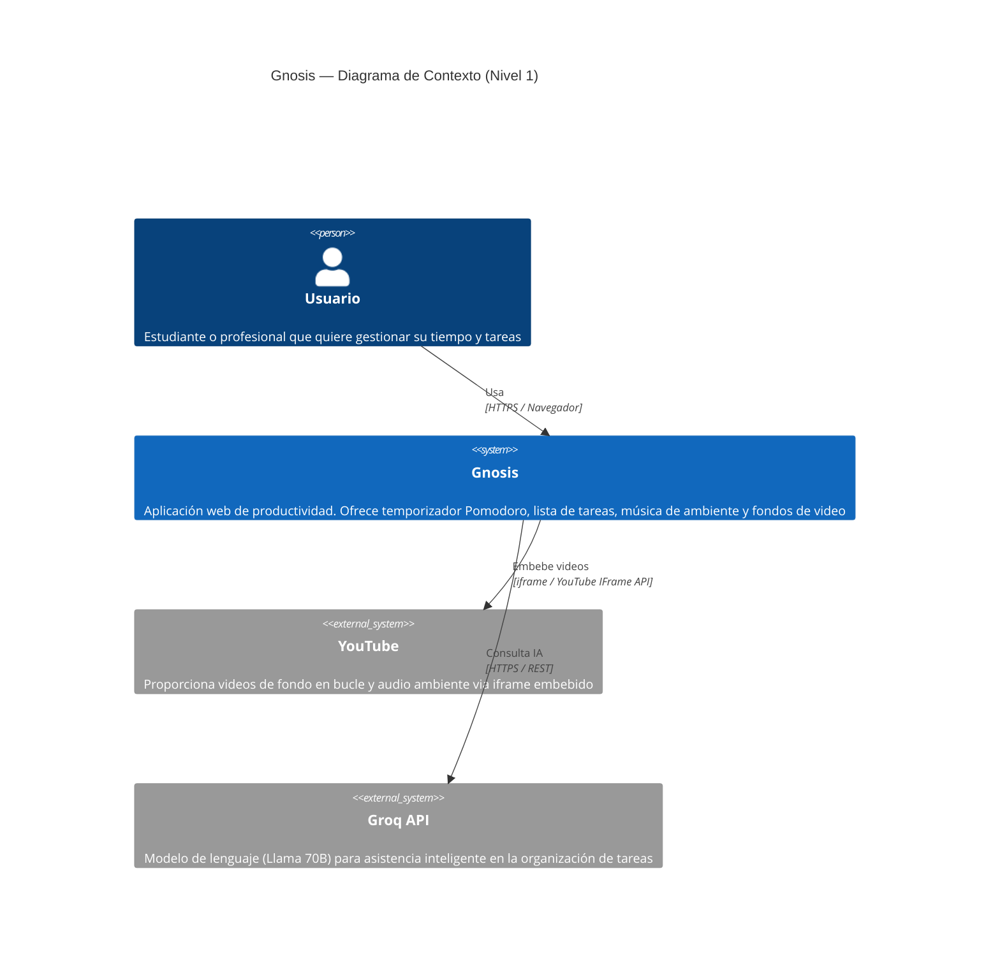

# Gnosis

Aplicación web de productividad personal construida con **Blazor WebAssembly** y arquitectura **N-Layer**. Combina un temporizador Pomodoro, lista de tareas, reproductor de música y fondos de video ambientales en una sola interfaz minimalista.

---

## Diagramas de arquitectura C4

### Nivel 1 — Contexto

> **Para quién es:** cualquier persona (técnica o no) que quiera entender qué hace el sistema y quién lo usa.
> **Pregunta que responde:** ¿Qué es Gnosis y cómo encaja en el mundo?




---

## Stack tecnológico

| Capa | Tecnología |
|---|---|
| Frontend | Blazor WebAssembly (.NET 8) |
| Backend | ASP.NET Core Web API (.NET 8) |
| ORM | Entity Framework Core |
| Base de datos | SQL Server |
| IA | Groq API — `llama-3.3-70b-versatile` |
| Video / Audio | YouTube IFrame API |
| Estilos | Bootstrap 5 + CSS custom |
| Persistencia cliente | localStorage (JS Interop) |

---

## Estructura de la solución

```
Gnosis/
├── Gnosis.Domain/          # Entidades e interfaces
├── Gnosis.Business/        # Modelos, DTOs y servicios de negocio
├── Gnosis.Infrastructure/  # Repositorios, DbContext, migraciones
├── Gnosis.WebApi/          # API REST (puerto 5173)
└── Gnosis.WebUI/           # Frontend Blazor WebAssembly (puerto 44372)
```

---

## Funcionalidades implementadas

- **Fondo de video** — iframe de YouTube en bucle a pantalla completa con carrusel de selección y miniaturas reales. Persiste entre sesiones via localStorage.
- **Panel Pomodoro** — temporizador flotante y arrastrable con modos Enfoque / Descanso Corto / Descanso Largo. Minimizable a lengüeta en el borde de la pantalla.
- **Lista To-Do** — panel flotante y arrastrable con tareas, subtareas, checkboxes y eliminación. Sincronizado con la base de datos via API.
- **Panel Música** — reproductor de audio de YouTube integrado con control de volumen y play/pause.
- **Asistente IA** — chat en barra inferior que conversa en español usando Llama 70B via Groq. Detecta cuándo el usuario quiere crear tareas y las agrega directamente al panel To-Do.
